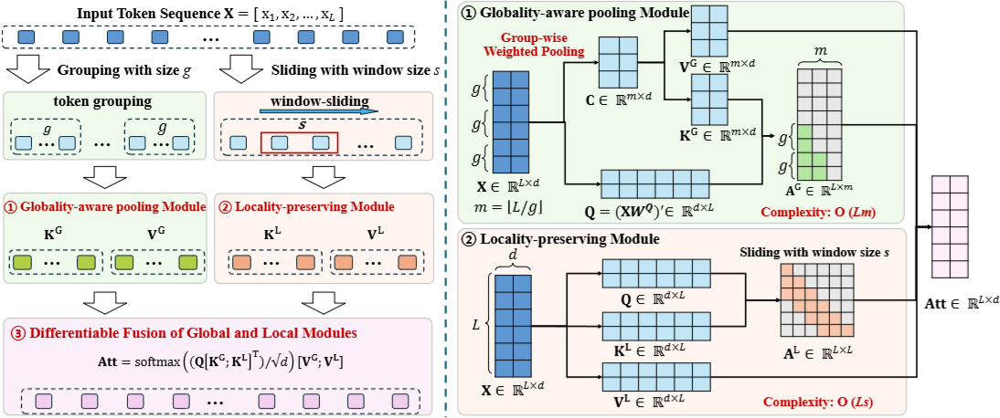
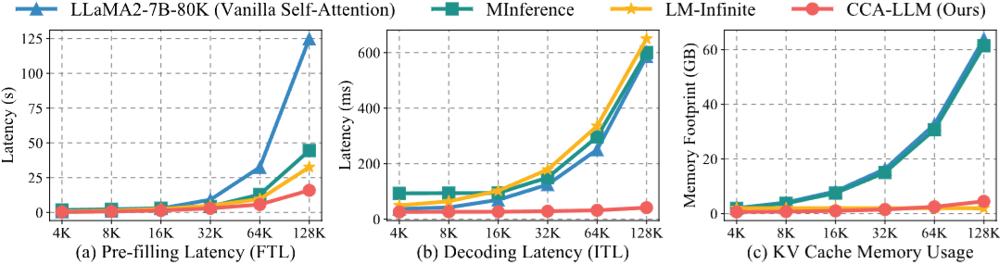

# CCA-Attention

This repository provides the code for the paper *"Core Context Aware Transformers for Long Context Language Modeling"*, which is accepted by ICML 2025.

## Abstract
Transformer-based Large Language Models (LLMs) have exhibited remarkable success in extensive tasks primarily attributed to self-attention mechanism, which requires a token to consider all preceding tokens as its context to compute attention. However, when the context length L becomes very large (e.g., 128K), the amount of potentially redundant information in the context tends to increase. The redundant context not only hampers the modeling representation performance but also incurs unnecessary computational and storage overhead. In this paper, we propose a plug-and-play Core Context Aware (CCA) Attention for efficient long-context modeling, comprising two complementary modules: 1) Globality-aware pooling module groups input tokens and dynamically compresses each group into one core token based on their significance. In this way, our method automatically focuses and strengthens core context while diminishing redundancy during the learning process, leading to effective long-term dependency modeling. 2) Locality-preserving module incorporates neighboring tokens to preserve local context for detailed representation. Notably, our CCA-Attention is able to replace the self-attention module in existing LLMs with minimal fine-tuning cost. Extensive experimental results show the superiority of our method in both long-context modeling and computational efficiency over state-of-the-art methods.




## Environment
- Python 3.10
- Pytorch 2.2.0
- Transformers 4.44.0
- CUDA 12.4
- Triton 3.2.0

## Replecing the Self-Attention Module
We provide a simple way to replace the self-attention module in the Transformer model series (Llama, GPT, etc.) with our CCA-Attention module. The following is an example of replacing the self-attention module in the Llama model.

```python
# if using KV cache compression with cca-attention, please import 'codebase.core.patch_simple' at the first line

# import codebase.core.patch_simple

import transformers
from codebase.core.simple_pooling_attn import replace_attn_forward

# Replace the self-attention module with CCA-Attention module prior to all codes
replace_attn_forward(group_size, window_size, pool_func="cca")

# Load the pre-trained model
model = transformers.AutoModelForCausalLM.from_pretrained(
		model_name_or_path,
		torch_dtype=torch.bfloat16,
	)
tokenizer = transformers.AutoTokenizer.from_pretrained(
		model_name_or_path,
		use_fast=True,
	)
```
## Finetuning with CCA-Attention
We finetune the models with per-source length upsampled data produced by [Long-Context-Data-Engineerin](https://github.com/FranxYao/Long-Context-Data-Engineering). You can download the dataset from their [HF Repo](https://huggingface.co/datasets/yaofu/slimpajama-per-source-length-upsample).

We provide a simple way to finetune the pre-trained model with our CCA-Attention module. The following is an example of finetuning the pre-trained Llama model with CCA-Attention.
You can modify the `finetune.sh` file to change the parameters of the finetuning process, including model path and dataset path.
```bash
bash run_scripts.sh finetune.sh /path/to/output $max_context_length 1000 $window_size $group_size cca
```

## Related Works
We implement this repository based on the following related works:
- Code based on [LongLoRA](https://github.com/dvlab-research/LongLoRA)
- Data from [Long-Context-Data-Engineering](https://github.com/FranxYao/Long-Context-Data-Engineering)
- LlaMA2 from [Meta](https://www.llama.com/llama2/)
Thanks for their great works!

## Citation
If you find this repository useful in your research, please consider citing our paper:
```bibtex
@inproceedings{chen2025core,
      title={Core Context Aware Transformers for Long Context Language Modeling}, 
      author={Yaofo Chen and Zeng You and Shuhai Zhang and Haokun Li and Yirui Li and Yaowei Wang and Mingkui Tan},
      year={2025},
      booktitle={International Conference on Machine Learning},
}
```